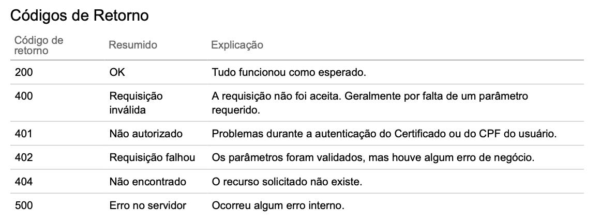
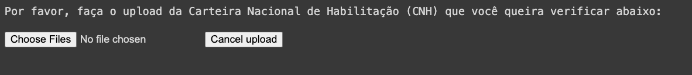
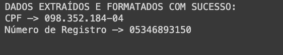
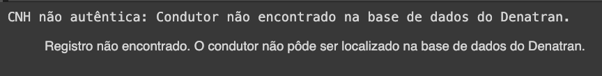
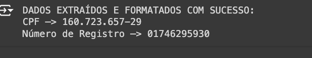
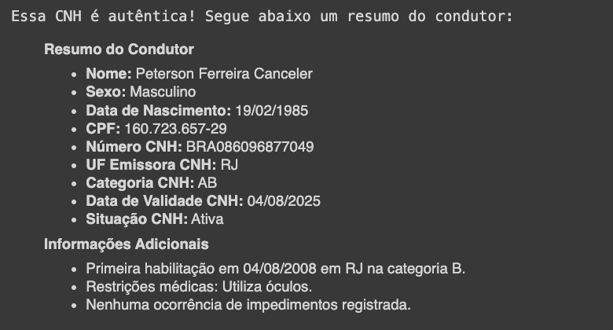

                                       INTRODUÇÃO | OBJETIVO DO detectCNH | TECNOLOGIAS E DOCUMENTAÇÕES | INSTRUÇÕES | RESULTADO

                                                                                        
# Introdução

---

O projeto detectCNH foi pensado para COMBATER A FRAUDE DE DOCUMENTOS no Brasil. A falsificação de documentos é um problema sério no país abrindo margem para prática de uma série de infrações bastante prejudiciais a sociedade, sendo a Carteira Nacional de Habilitação estando entre os documentos mais fraudados do país. Fiz esse projeto em resposta as notícias recentes em relação aos resgates que estão ocorrendo no Rio Grande do Sul, onde muitas pessoas estão se aproveitando para aplicar uma série de golpes. O detectCNH valida a autencidade das carteiras de motorista utilizando o Gemini AI do Google em conjunto com a API do Governo DENATRAN, onde o Gemini realiza a análise das imagens dos CNHs, a verifica nos bancos de dados do Governo Federal informações sobre o Condutor. Essa abordagem não é só a democratização ao acesso de tecnologia de ponta, é principalmente a esperança de que a falsificação de documentos deixe de ser um problema no nosso país. 

# Objetivo do detectCNH

---

O programa tem como objetivo verificar a autenticidade de uma Carteira Nacional de Habilitação (CNH) utilizando uma combinação de processamento de imagem, Google API Gemini, e Dados do Governo Federal.

**Funcionamento:**

1. **Coleta de dados:** O programa solicita ao usuário seu nome e CPF, e em seguida, pede para o usuário fazer upload de um arquivo contendo a imagem da CNH.
2. **Extração de dados da CNH:** O programa utiliza o modelo Gemini para analisar a imagem da CNH e extrair informações importantes, como CPF e número de registro.
3. **Validação com o Denatran:** O programa envia os dados extraídos da CNH para a API do Denatran para verificar sua autenticidade.
4. **Apresentação dos resultados e Geração de resumo:** Se a CNH for válida, o programa usa o Gemini para gerar um resumo informativo sobre os dados do condutor obtidos na API do Detran.

O detectCNH valida a autencidade das carteiras de motorista utilizando o Gemini AI do Google em conjunto com a API do Governo DENATRAN, onde o Gemini realiza a análise das imagens dos CNHs, a verifica nos bancos de dados do Governo Federal informações sobre o Condutor.

# Tecnologias utilizadas e suas documentações:

---

1. **Linguagem de programação: Python**
    - Documentação: **https://docs.python.org/3/**
2. **Bibliotecas Python:**
    - **pathlib**: Manipulação de arquivos e diretórios.
        - Documentação: **https://docs.python.org/3/library/pathlib.html**
    - **re**: Expressões regulares para encontrar padrões no texto.
        - Documentação: **https://docs.python.org/3/library/re.html**
    - **textwrap**: Formatação de texto, incluindo identação.
        - Documentação: **https://docs.python.org/3/library/textwrap.html**
    - **requests**: Fazer requisições HTTP para APIs.
        - Documentação: **https://docs.python-requests.org/en/latest/**
    - **Pillow (PIL)**: Processamento de imagens.
        - Documentação: **https://pillow.readthedocs.io/en/stable/**
    - **json**: Lidar com dados no formato JSON.
        - Documentação: **https://docs.python.org/3/library/json.html**
    - **PyPDF2**: Manipulação de arquivos PDF.
        - Documentação: **https://pypdf2.readthedocs.io/en/stable/**
    - **pdf2image**: Conversão de PDF para imagens.
        - Documentação: **https://pypi.org/project/pdf2image/**
    - **IPython.display**: Exibir conteúdo formatado (Markdown) no Jupyter Notebook.
        - Documentação: **https://ipython.readthedocs.io/en/stable/api/generated/IPython.display.html**
    - **google.colab**: Funções específicas para o Google Colaboratory.
        - Documentação: **https://colab.research.google.com/**
    - **google.generativeai**: Interação com a API do Google Gemini para geração de texto e visão computacional.
        - Documentação: https://ai.google.dev/gemini-api/docs
3. **Ferramentas:**
    - **Google Colaboratory**: Ambiente online para desenvolvimento em Python.
        - Documentação: **https://colab.research.google.com/**
    - **GitHub**: Plataforma para hospedagem e versionamento de código.
        - Documentação: **https://docs.github.com/**
    - **API do DENATRAN**: API pública do Departamento Nacional de Trânsito para consulta de dados de condutores.
        - Documentação: https://www.gov.br/conecta/catalogo/apis/wsdenatran
4. **Modelos de IA:**
    - **Google Gemini**: Modelo de IA generativa capaz de processar texto e imagens.

# Instruções:

## **Para saber sobre a API do DENATRAN**

Para usar a API do DENATRAN substitua no código “CONFIGURAÇÃO DA API DO DENATRAN**”** as seguintes credenciais:

```
# 1. O caminho do seu certificado digital
# 2. O caminho da sua chave privada
```

- Entre no site do Denatran para saber como conseguir essas credenciais -> [WSDenatran API - Veículos, Condutores e Infrações](https://colab.research.google.com/corgiredirector?site=https%3A%2F%2Fwww.gov.br%2Fconecta%2Fcatalogo%2Fapis%2Fwsdenatran)
- Neste repositório existe um arquivo chamado “**[WS Denatran - API-Doc v1.pdf](https://github.com/roanfersa/detectCNH/blob/main/WS%20Denatran%20-%20API-Doc%20v1.pdf)” neste arquivo contém a documentação desta API**

É necessário que seja configurado assim. 

```python
# URL da API do DENATRAN
url = f'https://renavam.denatran.serpro.gov.br/v1/condutores/cpf/{cpf_cnh}/registroCnh/{numero_registro_cnh}'

# Cabeçalhos
headers = {
    'x-cpf-usuario': x_cpf_usuario
}

# Certificado digital (ajuste o caminho para o seu certificado)
certificado = ('caminho_para_certificado.crt', 'caminho_para_chave_privada.key')
```

**ATENÇÃO**:  Para testar o detectCNH sem uma conexão com o API do DENATRAN, siga os passos abaixo:

```
# 1. Vá nos arquivos do repositório
# 2. Baixe o arquivo 'return_denatran_404.json' para simular um caso de CNH falsa e o arquivo return_denatran_200.json para simular um caso de CNH autêntica.
# 3. Vá na secção files aqui no google colab, e faça o upload dos arquivos.
# 4. Ajuste o path do arquivo para ""/content/return_denatran_200.json" ou "/content/return_denatran_404.json
```

Cada arquivo representa uma situação específica de resposta HTTP que poderia ser retornada pela API ao fazer uma requisição.

1. **O que é o return_denatran_200.json?**
    - Este arquivo contém o retorno de uma requisição bem-sucedida (**`HTTP 200 OK`**) à API do DENATRAN. O código **`200`** indica que a requisição foi processada com sucesso pela API e os dados solicitados estão sendo retornados.
    - As informações contidas neste arquivo foram **modificadas** para preservar a segurança do proprietário, o que sugere que embora os dados sejam baseados em informações reais, eles foram alterados para proteger a privacidade e a segurança dos dados pessoais.
2. **O que é o return_denatran_404.json?**
    - Este arquivo contém a resposta de uma requisição que resultou em um erro **`HTTP 404 Not Found`** pela API do DENATRAN. O código **`404`** indica que a informação solicitada não foi encontrada na base de dados do DENATRAN.
    - No contexto que você forneceu, é mencionado que este arquivo está relacionado às imagens de exemplo "cnh_falsa_pinterest.jpg" e "cnh_falsa_pinterest.pdf", o que pode sugerir que a requisição tentou verificar a autenticidade ou buscar informações sobre uma CNH que não existe ou não é válida dentro do sistema do DENATRAN.

Legenda de Códigos de Retorno:

                                                                                                  
# Resultado de Verificação de Fraude em CNH.

## Iniciando o detectCNH

---

**DetectCNH solicita:** 

Por favor, forneça as informações solicitadas abaixo para realizar a validação de autenticidade da CNH.
Digite seu nome: input[    ]
Digite seu CPF no formato XXX.XXX.XXX-XX: input [   ]

**Saída:**

                                                                                                        
---

## Fazendo o Upload da Carteira CNH (Imagem ou PDF)

---

**DetectCNH solicita:** 

                                                                                                          
**Saída:**

                                                                                              
**Atualização de Saída:**

                                                                                                                    
---

## Validação da CNH

---

### - CASO NÃO OK

- Foi utilizado uma CNH fictícia encontrada no pinterest → [Link da CNH](https://br.pinterest.com/pin/700169073344297072/)
- O arquivo.jpeg e pdf da CNH pode ser encontrada nesse repositório.

**DetectCNH extrai os dados:**


**DetectCNH valida e gera um resumo do condutor:**


### - CASO OK

- Aqui foi utilizada uma CNH real, porém os dados da .json foram modificados para manter a segurança do proprietário da CNH.
- O arquivo.json de resposta a requisição http feita a API do DENATRAN pode ser encontrada nesse repositório com o nome “**return_denatran_200.json”**

**DetectCNH extrai os dados:**


**DetectCNH valida e gera um resumo do condutor:**


