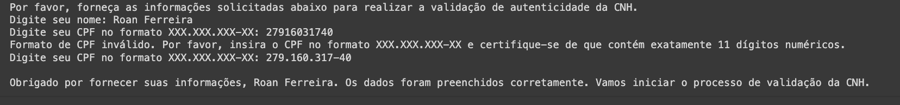
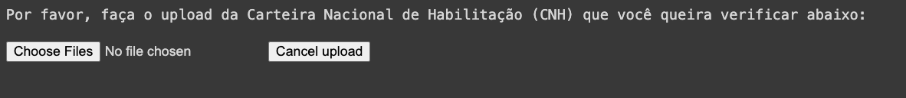
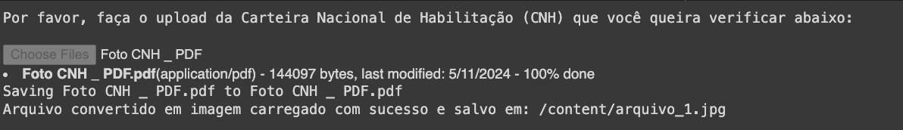
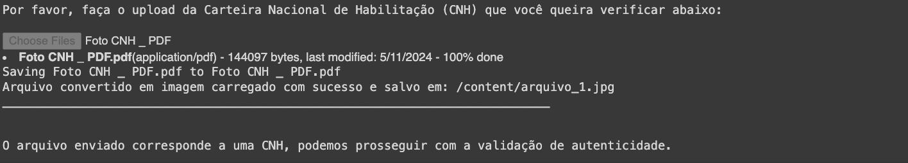
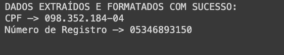
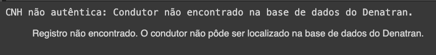
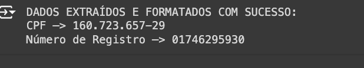
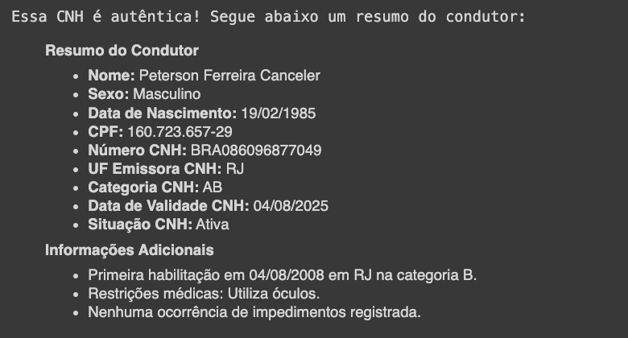

<p align="center">
  <a href="#introdução">Introdução</a>&nbsp;&nbsp;&nbsp;|&nbsp;&nbsp;&nbsp;
  <a href="#objetivo-do-detectcnh">Objetivo</a>&nbsp;&nbsp;&nbsp;|&nbsp;&nbsp;&nbsp;
  <a href="#tecnologias-utilizadas-e-suas-documentações">Tecnologias</a>&nbsp;&nbsp;&nbsp;|&nbsp;&nbsp;&nbsp;
  <a href="#instruções">Instruções</a>&nbsp;&nbsp;&nbsp;|&nbsp;&nbsp;&nbsp;
  <a href="resultados-da-verificação-de-fraude-em-cnh">Resultado</a>
</p>

<p align="center">
   
</p>

# Introdução

O projeto detectCNH foi pensado para COMBATER A FRAUDE DE DOCUMENTOS no Brasil. A falsificação de documentos é um problema sério no país, abrindo margem para práticas de uma série de infrações bastante prejudiciais à sociedade. A Carteira Nacional de Habilitação está entre os documentos mais fraudados do país. Esse projeto foi desenvolvido em resposta às notícias recentes sobre resgates que estão ocorrendo no Rio Grande do Sul, onde muitas pessoas estão se aproveitando para aplicar uma série de golpes. O detectCNH valida a autenticidade das carteiras de motorista utilizando o Gemini AI do Google em conjunto com a API do Governo DENATRAN, realizando a análise das imagens das CNHs e verificando informações sobre o condutor nos bancos de dados do Governo Federal. Essa abordagem representa não só a democratização do acesso à tecnologia de ponta, mas principalmente a esperança de que a falsificação de documentos deixe de ser um problema em nosso país.

# Objetivo do detectCNH

O programa tem como objetivo verificar a autenticidade de uma Carteira Nacional de Habilitação (CNH) utilizando uma combinação de processamento de imagem, Google API Gemini, e dados do Governo Federal.

**Funcionamento:**

1. **Coleta de dados:** O programa solicita ao usuário seu nome e CPF, e em seguida, pede para o usuário fazer upload de um arquivo contendo a imagem da CNH.
2. **Extração de dados da CNH:** O programa utiliza o modelo Gemini para analisar a imagem da CNH e extrair informações importantes, como CPF e número de registro.
3. **Validação com o Denatran:** O programa envia os dados extraídos da CNH para a API do Denatran para verificar sua autenticidade.
4. **Apresentação dos resultados e geração de resumo:** Se a CNH for válida, o programa usa o Gemini para gerar um resumo informativo sobre os dados do condutor obtidos na API do Detran.

# Tecnologias utilizadas e suas documentações

1. **Linguagem de programação:** [Python](https://docs.python.org/3/)
2. **Bibliotecas Python:**
   - [pathlib](https://docs.python.org/3/library/pathlib.html): Manipulação de arquivos e diretórios.
   - [re](https://docs.python.org/3/library/re.html): Expressões regulares para encontrar padrões no texto.
   - [textwrap](https://docs.python.org/3/library/textwrap.html): Formatação de texto, incluindo identação.
   - [requests](https://docs.python-requests.org/en/latest/): Fazer requisições HTTP para APIs.
   - [Pillow (PIL)](https://pillow.readthedocs.io/en/stable/): Processamento de imagens.
   - [json](https://docs.python.org/3/library/json.html): Lidar com dados no formato JSON.
   - [PyPDF2](https://pypdf2.readthedocs.io/en/stable/): Manipulação de arquivos PDF.
   - [pdf2image](https://pypi.org/project/pdf2image/): Conversão de PDF para imagens.
   - [IPython.display](https://ipython.readthedocs.io/en/stable/api/generated/IPython.display.html): Exibir conteúdo formatado (Markdown) no Jupyter Notebook.
   - [google.colab](https://colab.research.google.com/): Funções específicas para o Google Colaboratory.
   - [google.generativeai](https://ai.google.dev/gemini-api/docs): Interação com a API do Google Gemini para geração de texto e visão computacional.
3. **Ferramentas:**
   - [Google Colaboratory](https://colab.research.google.com/): Ambiente online para desenvolvimento em Python.
   - [GitHub](https://docs.github.com/): Plataforma para hospedagem e versionamento de código.
   - [API do DENATRAN](https://www.gov.br/conecta/catalogo/apis/wsdenatran): API pública do Departamento Nacional de Trânsito para consulta de dados de condutores.

# Instruções

Para saber mais sobre a API do DENATRAN, consulte a documentação no link disponível e substitua as credenciais necessárias no código da "CONFIGURAÇÃO DA API DO DENATRAN".

```
# 1. O caminho do seu certificado digital
# 2. O caminho da sua chave privada
```

- Entre no site do Denatran para saber como conseguir essas credenciais -> [WSDenatran API - Veículos, Condutores e Infrações](https://colab.research.google.com/corgiredirector?site=https%3A%2F%2Fwww.gov.br%2Fconecta%2Fcatalogo%2Fapis%2Fwsdenatran)
- Neste repositório existe um arquivo chamado “**[WS Denatran - API-Doc v1.pdf](https://github.com/roanfersa/detectCNH/blob/main/WS%20Denatran%20-%20API-Doc%20v1.pdf)” neste arquivo contém a documentação desta API**

É necessário que seja configurado assim. 

```python
# URL da API do DENATRAN
url = f'https://renavam.denatran.serpro.gov.br/v1/condutores/cpf/{cpf_cnh}/registroCnh/{numero_registro_cnh}'

# Cabeçalhos
headers = {
    'x-cpf-usuario': x_cpf_usuario
}

# Certificado digital (ajuste o caminho para o seu certificado)
certificado = ('caminho_para_certificado.crt', 'caminho_para_chave_privada.key')
```

**ATENÇÃO**:  Para testar o detectCNH sem uma conexão com o API do DENATRAN, siga os passos abaixo:

```
# 1. Vá nos arquivos do repositório
# 2. Baixe o arquivo 'return_denatran_404.json' para simular um caso de CNH falsa e o arquivo return_denatran_200.json para simular um caso de CNH autêntica.
# 3. Vá na secção files aqui no google colab, e faça o upload dos arquivos.
# 4. Ajuste o path do arquivo para ""/content/return_denatran_200.json" ou "/content/return_denatran_404.json
```

Cada arquivo JSON representa uma possível resposta da API ao fazer uma requisição, simulando diferentes cenários:

1. **return_denatran_200.json - Resposta de Sucesso**
   - **Descrição:** Este arquivo simula uma resposta bem-sucedida (`HTTP 200 OK`) da API do DENATRAN, indicando que a requisição foi processada com sucesso e os dados solicitados foram retornados.
   - **Segurança:** As informações neste arquivo foram alteradas para preservar a segurança e privacidade do proprietário dos dados.

2. **return_denatran_404.json - Resposta de Erro**
   - **Descrição:** Este arquivo simula uma resposta de erro (`HTTP 404 Not Found`) da API do DENATRAN, indicando que os dados solicitados não foram encontrados na base de dados.
   - **Contexto:** Este arquivo está relacionado às imagens "cnh_falsa_pinterest.jpg" e "cnh_falsa_pinterest.pdf", usadas para testar a validação de CNHs inexistentes ou inválidas no sistema do DENATRAN.

### Legenda de Códigos de Retorno


---


# Resultados da Verificação de Fraude em CNH

## Processo de Verificação de Usuário


**Início do Processo:**

Por favor, forneça as informações solicitadas abaixo para iniciar a validação da autenticidade da CNH:
- Nome: `Digite seu nome`
- CPF: `Digite seu CPF no formato XXX.XXX.XXX-XX`

**Resultado Inicial:**



### Upload da CNH

**Solicitação de Upload:**



**Saída do Processo:**

- **Início:** 
- **Conclusão:** 

## Avaliação da Autenticidade da CNH

### CNH Não Autêntica

- **Fonte:** CNH fictícia do Pinterest [Visualizar CNH](https://br.pinterest.com/pin/700169073344297072/)
- **Arquivos Associados:** JPEG e PDF disponíveis no repositório.

**Extração e Validação:**

- **Dados Extraídos:** 
- **Resumo do Condutor:** 

### CNH Autêntica

- **Fonte:** CNH real com dados modificados para segurança do proprietário.
- **Localização do Arquivo:** `return_denatran_200.json` no repositório.

**Extração e Validação:**

- **Dados Extraídos:** 

---

- **Resumo do Condutor:** 
